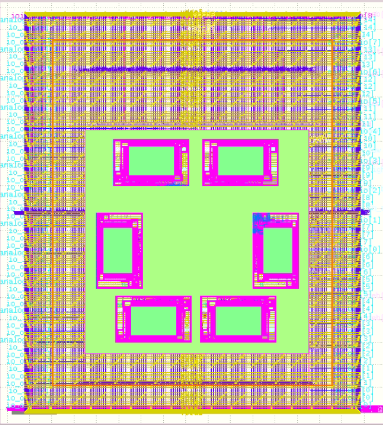

## UETRV_ESoC_v2
UETRV_ECORE_v2 is a RISC-V based SoC derived from [UETRV_ESoC](https://github.com/ee-uet/UETRV_ESoC) with a few changes (to see complete front-end code with video demo, please click [here](https://github.com/ee-uet/UETRV_ESoC/tree/UETRV_ESoC_v2)). UETRV_ESoC_v2 has been passed through the Cadence VLSI flow for submission to Google and Efabless' Open MPW-8 shuttle program using Skywater's open-source 130 nm PDK (the project can be found on Efabless' website [here](https://platform.efabless.com/projects/1549)). The verilog RTL used in this repo is generated from Scala source, available [here](https://github.com/ee-uet/UETRV_ESoC). Further details about the peripheral memory map, bootloader, example programs, testbenches etc. are also provided in that repo.

## [Video Demo](https://drive.google.com/file/d/1raqXAQvwz1TRjg51NF_Drprh9RkbB_k1/view?usp=sharing)
Practical demonstration of a **plotter**'s operation controlled by UETRV_ESoC_v2, programmed to an FPGA, can be viewed [in this video](https://drive.google.com/file/d/1raqXAQvwz1TRjg51NF_Drprh9RkbB_k1/view?usp=sharing).

## Updates from [UETRV_ESoC](https://github.com/ee-uet/UETRV_ESoC)
The following are the differences between UETRV_ESoC_v2 and UETRV_ESoC:

* Fixed width of address bus in the instruction bus. Previously, the address bus was 2 bits narrower than required for the instruction memory size specified in the config.scala file.
* Fixed selection of the motor control module to be accessed using the address given to data bus. Previously, although three motor control modules were instantiated, only the first motor module was accessible.
* Fixed data memory to be word-addressable. Previously, data memory was byte-addressable which did not map properly to the Skywater PDK's SRAMs.
* Added 2 inputs and 2 outputs to the motor control module, to aid in controlling stepper motors for a plotter's operation. The 2 inputs have been used to read the state of homing switches, and the 2 outputs have been used to provide the direction inputs to the stepper motor driver, but this usage of the IOs been done using firmware, thus they can be easily used for other purposes by modifying the firmware written in C language.
* Increased instruction memory size to 8 KB and data memory size to 4 KB. As shown in the image below, the 4 lower SRAMs constitute the instruction memory and the 2 upper SRAMs constitute the data memory.

  

## Testbench

The io_ports testbench provided in the caravel_user_project template configures and tests GPIOs' functionality. It has been merged with UETRV_ESoC's testbench ([old tb](https://github.com/ee-uet/UETRV_ESoC/blob/main/tb/SoC_tb.v)), resulting in [io_ports_tb.v](verilog/dv/io_ports/io_ports_tb.v). This testbench runs full chip simulation by configuring the GPIOs using firmware for caravel's management SoC. Following this, reset is applied which causes UETRV_ESoC_v2 to run its bootloader. The testbench mimics an SPI-based flash memory and loads a firmware into UETRV_ESoC_v2's instruction memory over GPIOs configured for SPI, in conjunction with the bootloader. Once loading of firmware is finished, the bootloader hands control over to the firmware. The firmware program transmits characters over UART, which are fed back to UETRV_ESoC_v2 by UART loopback. Some of these characters are commands for moving a plotter's pen as described below:

- 'u' to move pen up in 2D-grid
- 'd' to move pen down in 2D-grid
- 'l' to move pen left in 2D-grid
- 'r' to move pen right in 2D-grid
- 'L' for lifting the pen
- 'D' for dropping the pen

The testbench waits for each command to occur and verifies that the step and direction outputs for two stepper motors moving the pen in the 2D-grid, and the PWM output for the servo motor lifting and dropping the pen, have changed properly.
